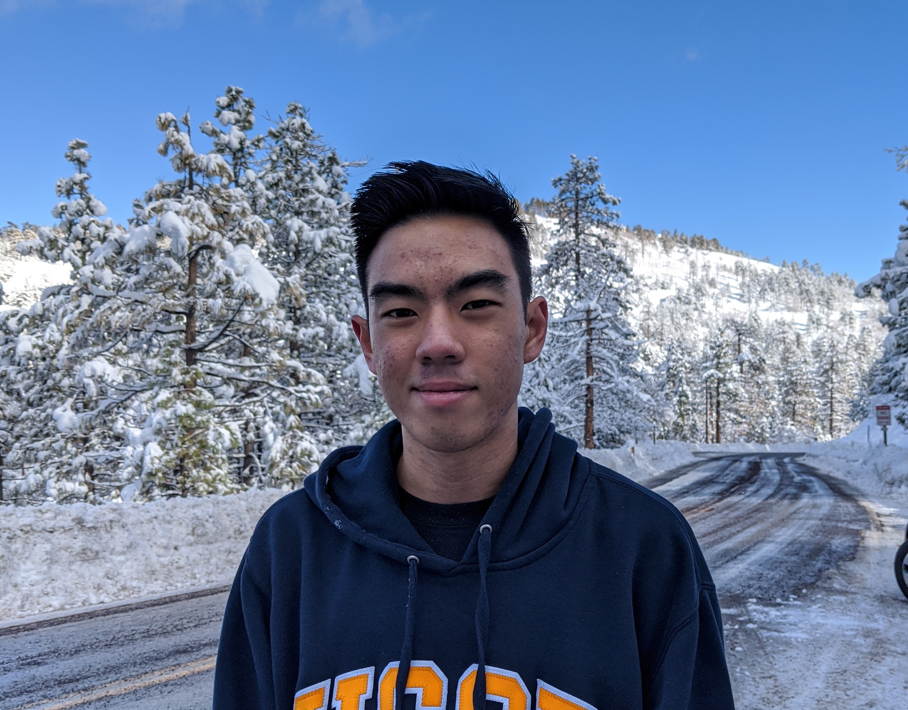
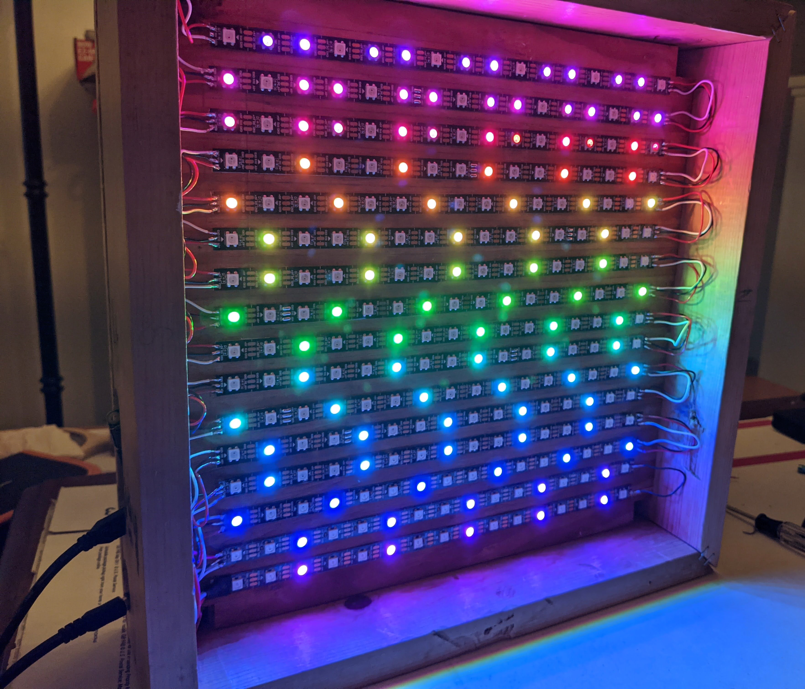

# Brandon Chaing

My name is Brandon Chaing, I am studying **Computer Engineering** at *University of California, San Diego*.

One of the quotes that I follow most as a programmer is from one of my introductory Computer Science professors, Niema Moshiri:
> Start Early, Start Often

If you want to see my interests other than programming, check out the [interests section](#Interests).

To see some of recent projects, you can check my [github](https://github.com/bchaing).

You can use `git clone` to use these projects on your local machine. \
If you want to read more about this current repo, check out [the readme file](README.md).

3 of the programming languages that I am most familiar with:
1. C++
2. Javascript
3. Python

Here's a picture of one of my recent projects that is still in progress: 

# Interests
Below are some of my interests other than programming:
- Running
- Musical Theatre
- Hiking
- Theme Parks and Themed Entertainment

Some of my goals for the near future:
- [x] Become more familar with Python
- [x] Participate in a Hackathon
- [ ] Lead a project
- [ ] Learn guitar
